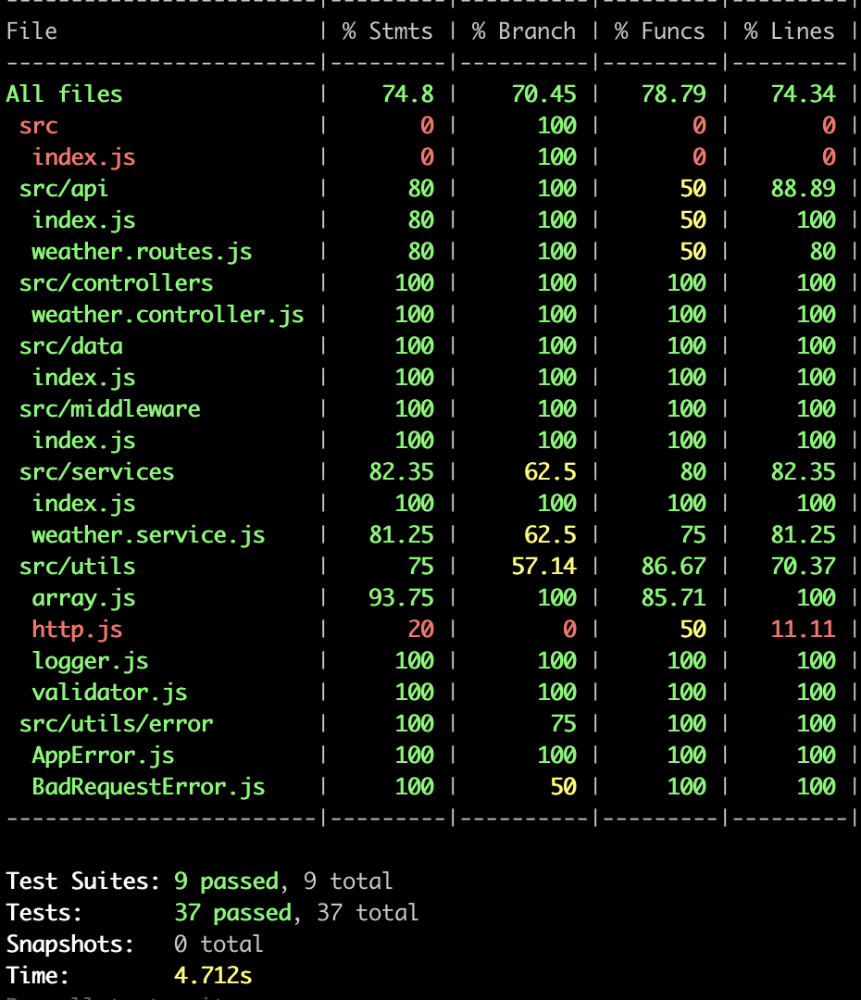
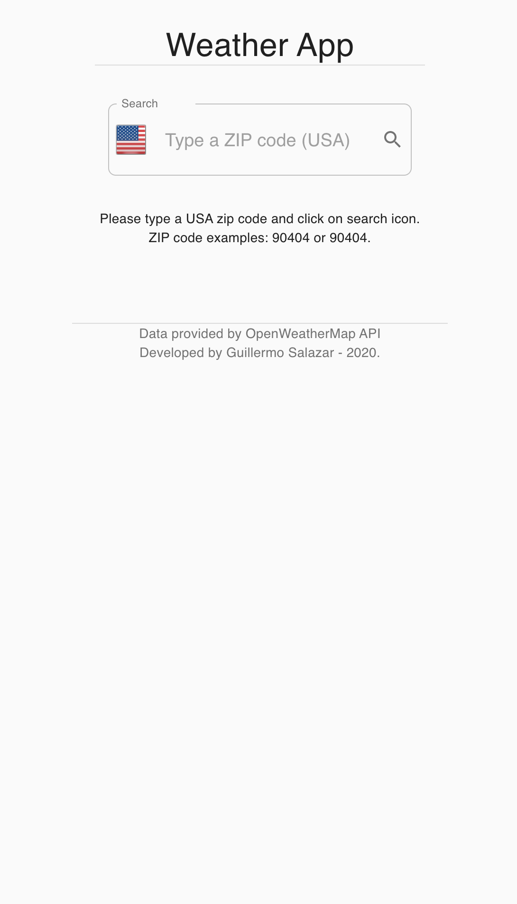
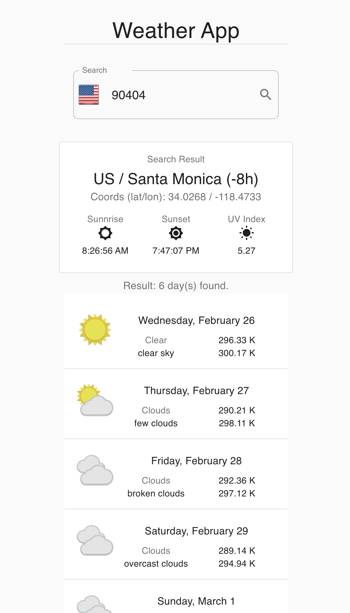
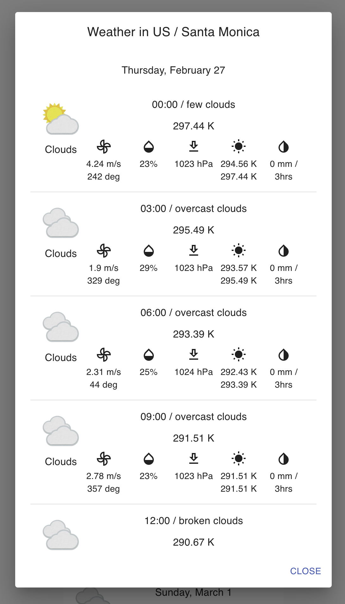

# Weather App

The project is an app to display the weather from the USA cities using zip codes.

This is the online [link](https://weather-usa-app.herokuapp.com/).

## Get Started

- Execute `yarn install` in `app` and `api` folders.
- Create `.env` file in `app` and `api`. **Copy/paste the .env.template from each folder**.
- Set the `OPEN_WEATHER_MAP_KEY` env variable in the `/api/.env` file.
- Execute `yarn dev` in `api` folder.
- Execute `yarn start` in `app` folder.
- Go to `http://localhost:8081/` in your browser.

## Backend / Rest API

### Rest API Frameworks

- Node JS
- Express
- Axios

### Endpoints

The app contains the following endpoints:

- `/api/v1/weather/:countryCode/:zipCode`

It returns the weather for the city defined by the zip code and country. Also, it returns the city details, and UV index data.

### Unit Test

The API project has 37 unit tests, and a code coverage +70%.

## FrontEnd / Web App

### Web App Frameworks

- React
- Redux
- Redux Thunk
- Axios

## App

### Screenshoots

### Pending Tasks

- Use Docker Compose for both projects.
- FrontEnd: Add unit tests and code coverage.
- BackEnd: Add caching.
- BackEnd: Improve how the URL is created.
